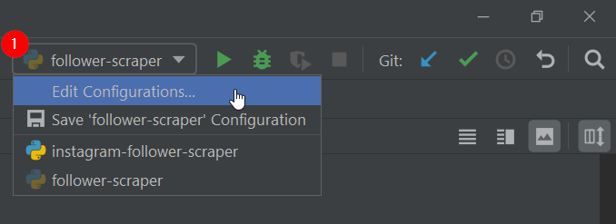
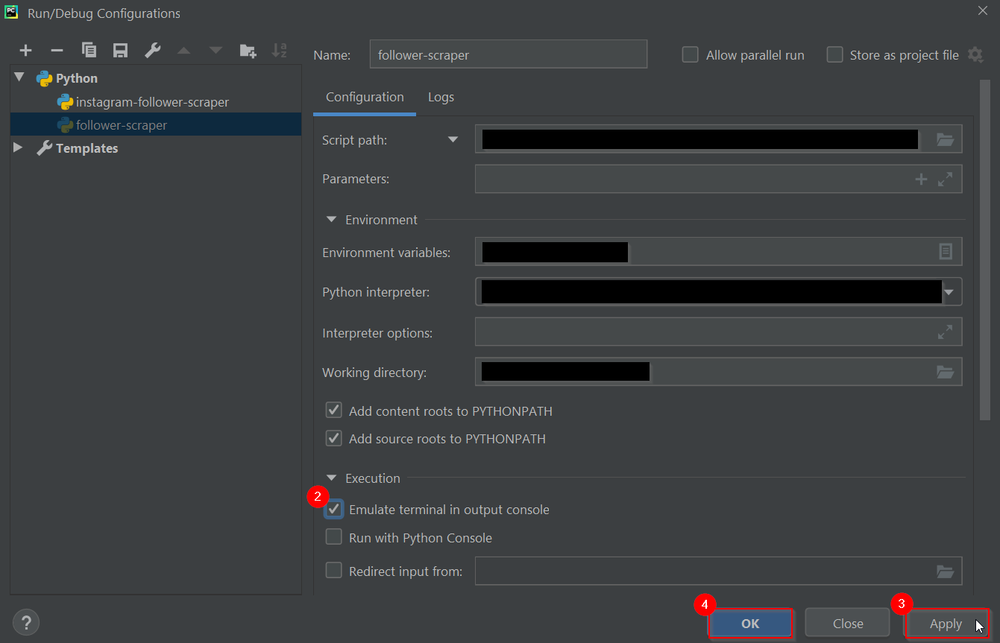

# linkedin-api-company-follower-scraper

## Disclaimer

| :warning: | Use on your own risk, the author of this project is not liable for :exclamation: |
| --- | --- |
| :warning: | This project was made for research and educational purposes **ONLY**:exclamation: |
| :warning: | This project violates Linkedin's User Agreement, and because of this, Linkedin may (and will) temporarily or permanently ban your account. We are not responsible for your account being banned:exclamation: |

## Description

This script scrapes the follower list and their profile information of **ANY** company profile, if admin rights of the company are available, and saves the data into an excel file. Furthermore, it provides the possibility to specify any number of keywords which are used to compare to the follower's information and highlight matching cells.

This project was build for research and educational purposes **ONLY**. Use with caution and on your own risk:exclamation:

## Prerequisites

Please keep in mind that this only functions when certain conditions are met:

- stable internet connection
  
- [download](https://chromedriver.chromium.org/downloads) suitable Chromedriver
  
- valid LinkedIn account with Admin rights to a company
  

## Configuration

- Python Version used: Python 3.8.5
  
- PyCharm IDE Version used: PyCharm Community Edition 2020.1.4
  
- [Chromedriver](https://chromedriver.chromium.org/downloads) Version used: [ChromeDriver 107.0.5304.62](https://chromedriver.storage.googleapis.com/index.html?path=107.0.5304.62/)
  
- Make sure to install following packages after cloning this project
  
  - pip install selenium
    
  - pip install pandas
    
  - pip install openpyxl
    
  - pip install XlsxWriter
    
  - pip install [linkedin_api](https://github.com/tomquirk/linkedin-api) → Credits to [Tom Qurik](https://github.com/tomquirk) | linkedin_api [documentation](https://linkedin-api.readthedocs.io/en/latest/)
    
- In case of PyCharm IDE
  
  - Before running the script make changes to the run configurations of PyCharm:
    
    a. Navigate to the right top corner, open the dropdown and click on "Edit Configuration"
    
    b. Under Execution select the "Emulate terminal in output console" option
    
    c. Apply all changes with "apply"
    
    

        

    

## Common Issues

If issues occur it can be due to the fast changing source code of IG the code needs to be maintained, if this is the case open an issue and ill get to is asap

Possible Solutions:

- Try to rerun, it is possible that there was disturbance
  
- Try to re-specify the HTML elements in particular the pop-up message handler using the xPath or full xPath selector
  
- Make sure that the Chromedriver suits your google Chrome version
  

→ If there are other issues don't hesitate to open a new [issue](https://github.com/NaBo-00/linkedin-api-company-follower-scraper/issues/new).

## Contact

If you have any questions, face any problems or have any improvement suggestions do not hesitate to contact me or open a new [issue](https://github.com/NaBo-00/linkedin-api-company-follower-scraper/issues/new).

---

Made by NaBo-00 | Copyright (c) NaBo-00 | All Rights Reserved

